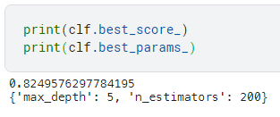

# Overview
This is the notebook for the [Titanic](https://www.kaggle.com/competitions/titanic/) on Kaggle so for more information, please go there.

# Library used in this notebook
1. [Pandas v1.4.3](https://pandas.pydata.org)
2. [Numpy v1.23.0](https://numpy.org)
3. [Scikit-learn v1.1.2](https://scikit-learn.org/stable/)

# Implementation
1. Removing features with too many unique values or missing values
2. Applying one-hot encoder on **Pclass** and **Embarked** features
3. Encoding _male_ as 1 and _female_ as 0 for **Sex** feature
4. Applying [MinMaxScaler](https://scikit-learn.org/stable/modules/generated/sklearn.preprocessing.MinMaxScaler.html)
5. Using [GridSearchCV](https://scikit-learn.org/stable/modules/generated/sklearn.model_selection.GridSearchCV.html) with a [RandomForestClassifier](scikit-learn.org/stable/modules/generated/sklearn.ensemble.RandomForestClassifier.html) using parameters :

| Parameters | Values |
| --- | --- |
| n_estimators | 100  200  500  1000 |
| max_depth | 2  3  4  5  6 |

We then achieve best result with :

Which ends up with a 0.77033 on public score.

# Further information
For my [Kaggle profile](https://www.kaggle.com/agrocarp)
